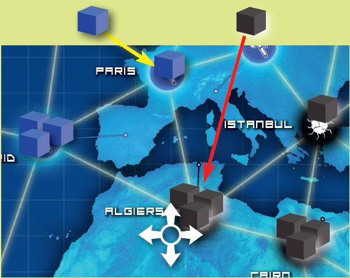
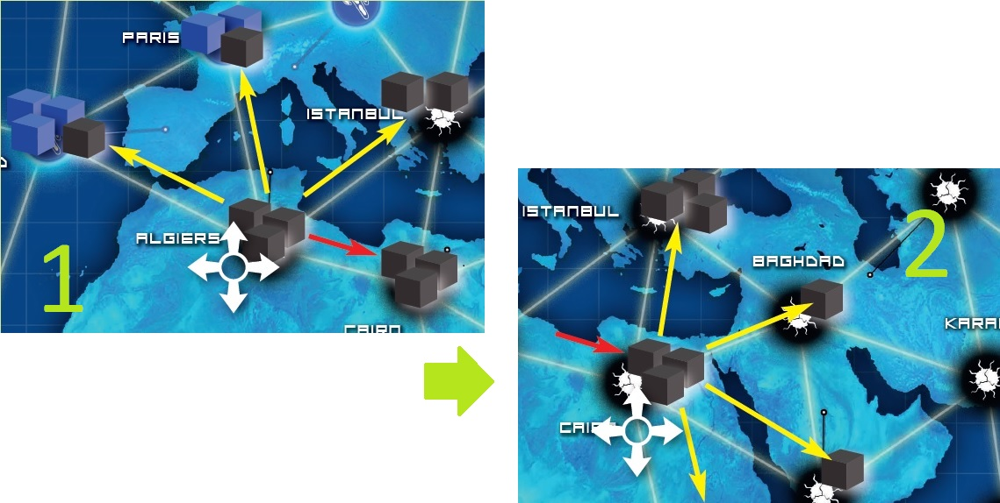

#HSLIDE?image=assets/fond.jpg

##Erlang

Yvan VU @JeSuisSocial

#HSLIDE

## A BRIEF HISTORY

#VSLIDE

#### 1987 : Erlang's birth
by Joe Armstong, Robert Virding and Mike Williams

#VSLIDE

#### Constraints

- Systems distributed with large number of concurrent activities
- High Availability
- Software maintenance without stopping the system
- Stringent quality and reliability
- Fault tolerance

#VSLIDE

#### Major facts
- 1995 : OTP
- 1998 : Open-source following Ericsson's ban
- Today : Amazon SimpleDB, Ejabberd, RabbitMQ, WhatsApp

#HSLIDE

## DEMO

#VSLIDE

- REPL
- Module & Module attributes
- Function
- Type

#VSLIDE

## PATTERN MATCHING

#HSLIDE

#### Pandemic (Intro)

- a City has a name and neighbours

#VSLIDE

#### Infect

- increases its disease level by 1
- if the disease level is already at 3, an outbreak occurs

#VSLIDE

#### Outbreak 
infect each neighbours in a chain without infecting the same city twice

#VSLIDE

#### Functions signatures

- City = {*CityName*, *[Neighbours]*, *Infections*}
- infect = {ok, *InfectedCity*}
- outbreak = {outbreak, *[Neighbours]*}

#HSLIDE

## PROCESSES & MESSAGES

#HSLIDE

## HOT SWAPPING